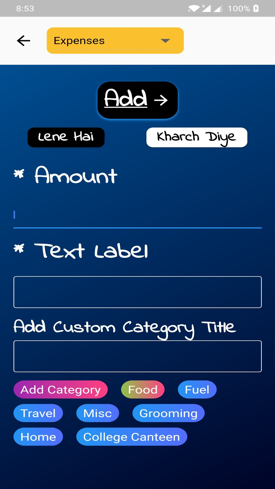

# budgetingapp
# XBudget

First Income and Expense Tracking Budget Application developed using Flutter

XBudget is an income and expense tracking application developed using Flutter platform. It will help you plan budgets for every customised spending cycle. Now, visualise your expenses and spending habits with XBudget. This mobile application will help you figuring out where you are spending the most, all the time, and will help in making smarter decisions in future. Now don't worry where your money went at the month-end because we will be there for you every step of the way. IT IS A MUST UTILITY FOR YOUNGSTERS AND COLLEGE STUDENTS

[Play Store](https://play.google.com/store/apps/details?id=stucktle.budgetingapp)

## Features

* [x] Android (iOS Coming Soon)

  * [x] Add Income/Expense data
  * [x] Use Customised spending cycle
  * [x] Animation
  * [x] Full Fledged Example
  * [x] Delete Income/Expense data
  * [x] Visualise Spending Habits
  * [x] Access Past Budget's data
  * [x] Account Summary(Income/Expense/Balance)
  * [x] Add Custom Category title
  * [x] Special Pocket Money Category
  * [x] Quick Access to Recent and All Spend's and Income
  * [x] Google Login integration

* Supported formats

  * [Android](https://developer.android.com/guide/topics/media/media-formats.html)

### Show some :heart: and star the repo to support the project

### Screenshots

    

## iOS

### Alert: iOS implementation

This project is not implemented for ios yet.So wait for it or if you can contribute then please do help.

# Pull Requests

I welcome and encourage all pull requests. It usually will take me within 24-48 hours to respond to any issue or request. Here are some basic rules to follow to ensure timely addition of your request:

1.  Match coding style (braces, spacing, etc.) This is best achieved using `Reformat Code` feature of Android Studio `CMD`+`Option`+`L` on Mac and `CTRL` + `ALT` + `L` on Linux + Windows .
2.  If its a feature, bugfix, or anything please only change code to what you specify.
3.  Please keep PR titles easy to read and descriptive of changes, this will make them easier to merge :)
4.  Pull requests _must_ be made against `develop` branch. Any other branch (unless specified by the maintainers) will get rejected.
5.  Check for existing [issues](https://github.com/chirag10k/Expense-Budget-Tracker/issues) first, before filing an issue.
6.  Make sure you follow the set standard as all other projects in this repo do
7.  Have fun!

### Created & Maintained By

[Chirag Saraogi](https://github.com/chirag10k) ([@ChiragSaraogi](https://twitter.com/ChiragSaraogi)) ([Insta](https://www.instagram.com/chirag_c.s/)

> If you found this project helpful or you learned something from the source code and want to thank me, consider buying me a cup of :coffee:
>
> * [PayPal](https://paypal.me/chirag10k)

# License

     Copyright [2020] [Chirag Saraogi]

   Licensed under the Apache License, Version 2.0 (the "License");
   you may not use this file except in compliance with the License.
   You may obtain a copy of the License at

       http://www.apache.org/licenses/LICENSE-2.0

   Unless required by applicable law or agreed to in writing, software
   distributed under the License is distributed on an "AS IS" BASIS,
   WITHOUT WARRANTIES OR CONDITIONS OF ANY KIND, either express or implied.
   See the License for the specific language governing permissions and
   limitations under the License.

## Getting Started

This project is a starting point for a Flutter application.

A few resources to get you started if this is your first Flutter project:

- [Lab: Write your first Flutter app](https://flutter.dev/docs/get-started/codelab)
- [Cookbook: Useful Flutter samples](https://flutter.dev/docs/cookbook)

For help getting started with Flutter, view our
[online documentation](https://flutter.dev/docs), which offers tutorials,
samples, guidance on mobile development, and a full API reference.
